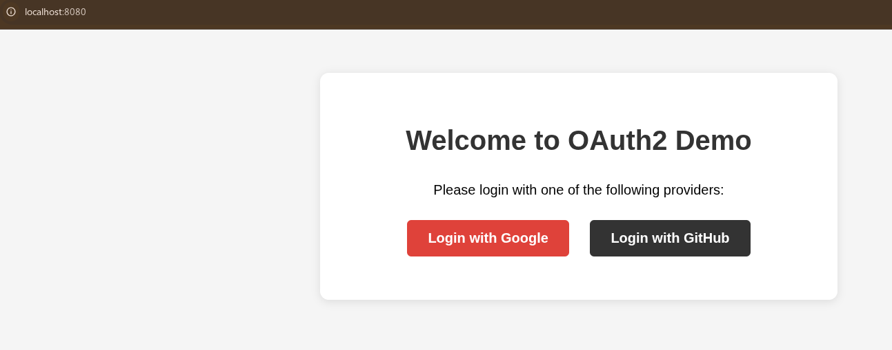
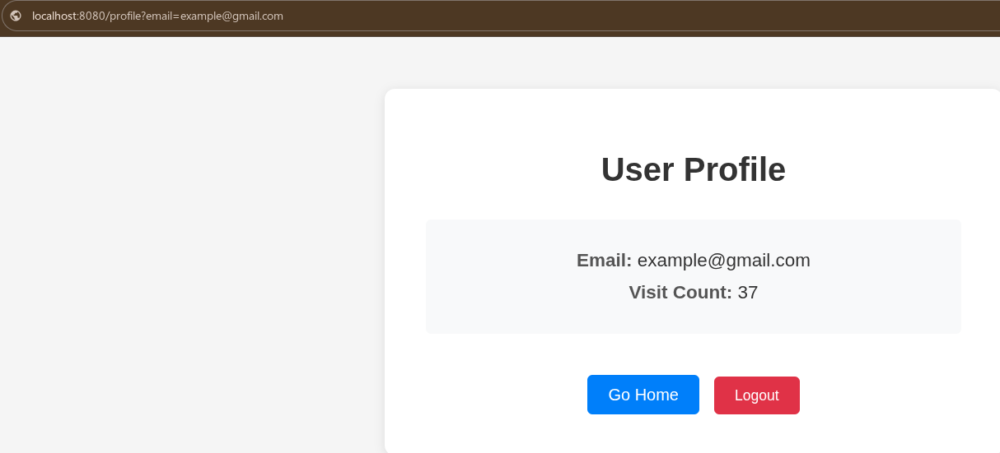

# OAuth2 Demo

Simple OAuth2 login demo with Google and GitHub integration.

## Home Page
Login with Google or GitHub OAuth2 providers.

## User Flow
- Captures user email after successful OAuth2 login
- Creates new user if doesn't exist in database
- Tracks visit count for each profile access

## Database Persistence
Visit count is incremented and persisted in PostgreSQL database.

*Note: Original email addresses changed to example@gmail.com for privacy*
